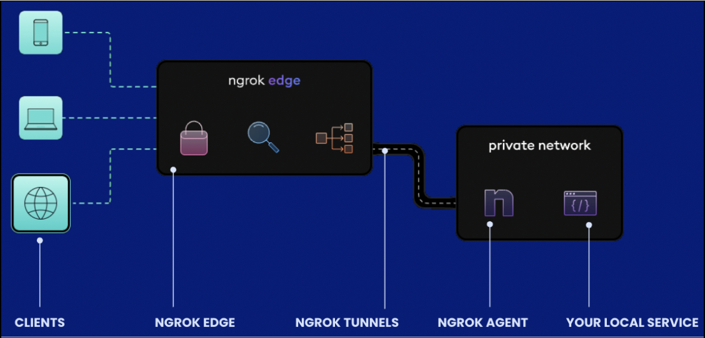

# **How-to-use-ngrok**
How to use ngrok as a tool for app development

## **What is ngrok?**
Ngrok is a developer tool which translates your localhost, for example http://12.0.2.2:5400, into a public url ,for example https://xxxxx.ngrok-free.app. Ngrok was originally developed by **Alan Shreve**, who launched it in 2013 as a personal project. Later on, Alan founded a company also called ngrok, Inc., which continued to develop the service, offering both free and paid versions with additional features like authentication, custom domains, and more tools for developers.



## **How can I use it?**
Althought there is an paid version, in this document I will explain how to use the free version because it's quite useful for the early steps in your app development.

### **1. Install ngrok**
I recommend visiting the oficial website of ngrok, https://ngrok.com/downloads/linux, where they explain how to install in many agents. I use linux and executed the following command in my shell:
``` 
sudo snap install ngrok
```

### **2. Configure ngrok**
You need to sing up in ngrok for a free acount in order to obtain your own *authtoken*. Once you have it, you have to use config it with the following command:
```
ngrok config add-authtoken <token>
```

### **3. Start an endpoint**
Finally, you have to select the port which will be exposed with ngrok.

> Before using it, make sure your local service is running on the port you want to expose.


If you are using a web app, you will use:
```
ngrok http [port]
```

But if you want to use a tcp service, you will use:

```
ngrok tcp [port]
```

Furthermore, if you want extra security, you could use *--basic-auth=user:password* to avoid other unauhtorized people using your url (and local resources).

```
ngrok http --basic-auth=user:password [port]
```

Once you have executed the command, something like this will apear on your shell: 


Your public url is shown here and now you only have to replace in the code the old localhost url with the new public url.


