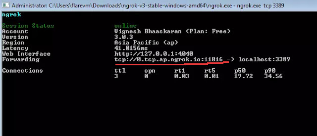

# **How to Use ngrok**

How to use ngrok as a tool for app development

## **What Is ngrok?**

ngrok is a developer tool that translates your localhost, for example `http://12.0.2.2:5400`, into a public URL, for example `https://xxxxx.ngrok-free.app`. ngrok was originally developed by **Alan Shreve**, who launched it in 2013 as a personal project. Later on, Alan founded a company also called ngrok, Inc., which continued to develop the service, offering both free and paid versions with additional features like authentication, custom domains, and more tools for developers.


## **How Can I Use It?**

Although there is a paid version, in this document I will explain how to use the free version because it's quite useful for the early steps in your app development.

### **1. Install ngrok**

I recommend visiting the official website of ngrok:
[https://ngrok.com/downloads/linux](https://ngrok.com/downloads/linux)
There, they explain how to install it on many platforms. I use Linux and executed the following command in my shell:

```bash
sudo snap install ngrok
```

### **2. Configure ngrok**

You need to sign up for a free ngrok account in order to obtain your own *authtoken*. Once you have it, configure it with the following command:

```bash
ngrok config add-authtoken <token>
```

### **3. Start an Endpoint**

Finally, you have to select the port which will be exposed with ngrok.

> **Note:** Make sure your local service is running on the port you want to expose before starting ngrok.

If you are using a web app, you will use:

```bash
ngrok http [port]
```

But if you want to use a TCP service, you will use:

```bash
ngrok tcp [port]
```

Furthermore, if you want extra security, you can use `--basic-auth=user:password` to prevent unauthorized users from accessing your URL (and local resources):

```bash
ngrok http --basic-auth=user:password [port]
```

Once you have executed the command, you’ll see something like this in your terminal:


Your public URL is shown here, and now you only have to replace the old localhost URL in your code with the new public URL.

It is important to note that if you shut down the ngrok service and you are using the free plan, the URL will change the next time you turn on ngrok.

---

## **Example of Use**

Imagine that you and your team are developing an app in Flutter that requires access to a server hosting a PostgreSQL database. If you're all working on your own PCs and want to share the database, you could use Docker to run the database and ngrok to expose it, so everyone connects to the same database with the same records.

One option is using a **Raspberry Pi** as a server, and everyone could connect to it thanks to the public URL that ngrok will provide.

Your `register_screen` might look like this:

```dart
final url = Uri.parse('http://10.0.2.2:8000/auth/register');  // /auth/token if you are in the login screen

final response = await http.post(
    url,
    headers: {'Content-Type': 'application/json'},
    body: json.encode({'email': _email, 'password': _password}),
);
```

Here, `"http://10.0.2.2:8000"` is the URL of your local database. To share the same database endpoint, replace your localhost URL with the ngrok URL.

For example, if you’ve decided to use `--basic-auth`, you’ll need to include an authorization header in your request, like this:

```dart
final url = Uri.parse('https://xxxxxxx.ngrok-free.app/auth/register'); // /auth/token for login_screen

final authHeader = 'Basic ' + base64Encode(utf8.encode('user:password'));

final response = await http.post(
    url,
    headers: {
      'Content-Type': 'application/json',
      'Authorization': authHeader,
    },
    body: json.encode({'email': _email, 'password': _password}),
);
```
